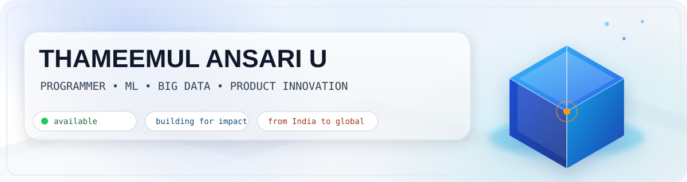

<h1 align="center">THAMEEMUL ANSARI U</h1>

<b>Programmer • Aspiring Entrepreneur • India</b>

  

  

  
  
  
  

---

## What I Do

  
  

  
  

  
  
  
  

## Tech Stack

  

## Cool Live Stats

  

  
  

  

## Project Spotlight

  
  

  

  
  

## Connect

  
  

  

## Contribution Snake

---

<i>Always learning. Always building.</i>

